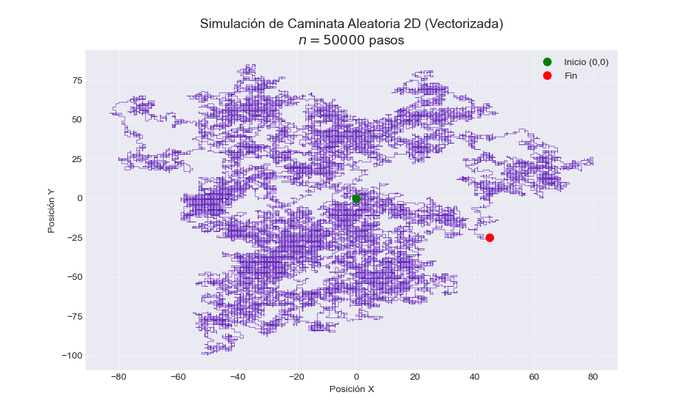
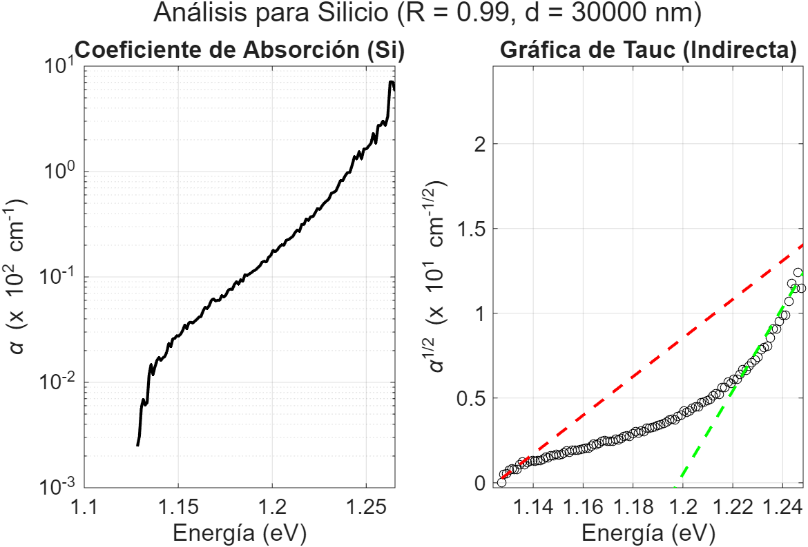
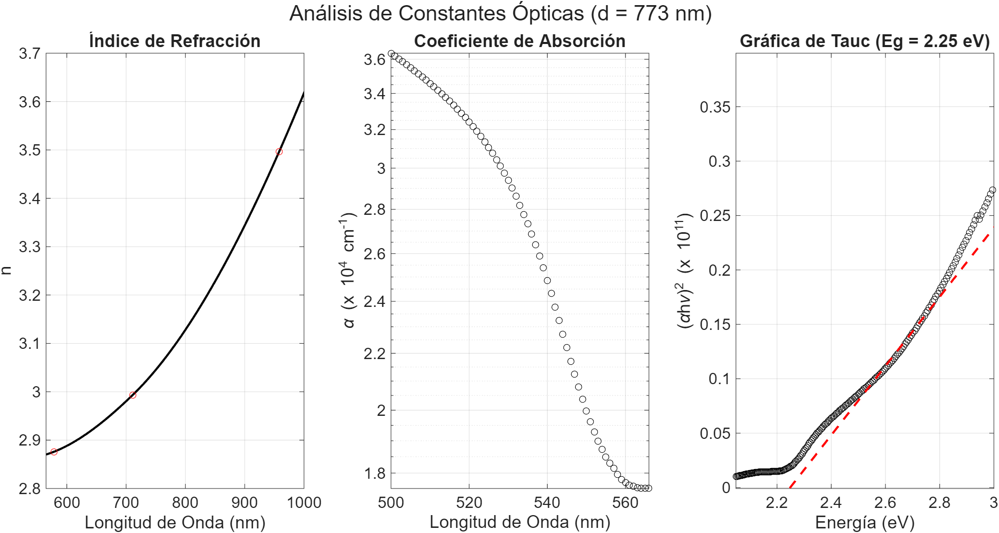

# Quantitative Analysis & Stochastic Modeling Portfolio

  

## Overview
This repository serves as a technical portfolio demonstrating the application of **Physics-based numerical methods** to solve data-intensive problems. It bridges the gap between theoretical frameworks (Stochastic Processes, Signal Processing) and practical computational implementation.

The projects included showcase skills in **vectorized computing**, **automated data cleaning (ETL)**, and **non-linear parameter estimation**, skills directly transferable to **Quantitative Finance** and **Credit Strategy** domains.

---

## Project 1: 2D Random Walk Simulation (Vectorized)
**File:** `random_walk_vectorized.py`

### Description
A high-performance simulation of a 2D Lattice Random Walk, a fundamental stochastic process analogous to **Brownian Motion** used in financial market modeling and diffusion risk analysis.

### Technical Highlights
* **Vectorization:** Refactored procedural loops into **NumPy** matrix operations (`np.cumsum`, `fancy indexing`), optimizing memory usage and execution time for $N > 10^5$ steps.
* **Visualization:** Implemented clear data visualization using Matplotlib to map the stochastic trajectory.
* **Relevance:** Demonstrates understanding of **Markov Processes** and efficient algorithmic design.


*(Example output: Stochastic trajectory for N=50,000 steps)*

---

## Project 2: Spectral Data ETL & Analysis Pipeline
**File:** `spectral_analysis_pipeline.m`

### Description
An automated pipeline developed in **MATLAB** to ingest, clean, and analyze raw noisy data from spectrophotometers. The script automates the extraction of optical constants using the **Swanepoel Method**.

### Technical Highlights
* **Automated ETL:** Loops through raw `.txt` datasets, handles missing values (`NaN`), and removes artifacts/duplicates without manual intervention.
* **Signal Processing:** Implements smoothing algorithms and peak detection to isolate signal from experimental noise.
* **Non-Linear Fitting:** Applies **Cauchy** and **Tauc** models via regression analysis to derive material properties ($n$, $k$, $E_g$).
* **Relevance:** Showcases the ability to build robust **Data Pipelines** that transform unstructured raw data into actionable insights.

---

## 🛠 Tools & Technologies
* **Languages:** Python (NumPy, Matplotlib), MATLAB.
* **Concepts:** Monte Carlo Simulations, Time Series Analysis, Experimental Design, Numerical Optimization.

* 
* 

## Usage
To run the Python simulation locally:

```bash
# Clone the repository
git clone [https://github.com/tu-usuario/Quantitative-Physics-Portfolio.git](https://github.com/tu-usuario/Quantitative-Physics-Portfolio.git)

# Install dependencies
pip install numpy matplotlib

# Run the script
python random_walk_vectorized.py
