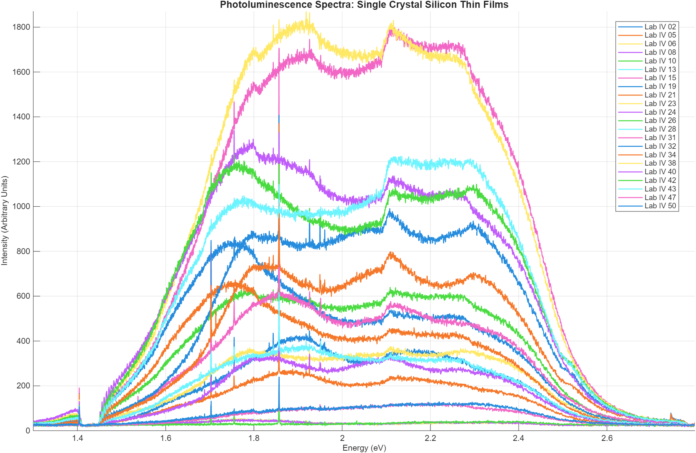
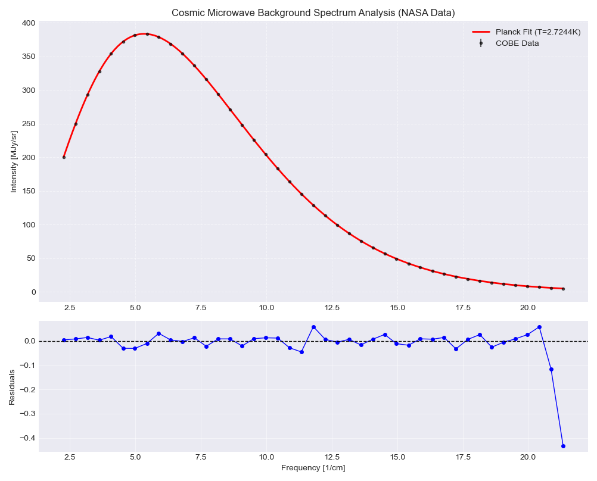

# Quantitative Analysis & Stochastic Modeling Portfolio

  

## Overview
This repository serves as a technical portfolio demonstrating the application of **Physics-based numerical methods** to solve data-intensive problems. It bridges the gap between theoretical frameworks (Stochastic Processes, Signal Processing) and practical computational implementation.

The projects included showcase skills in **vectorized computing**, **automated data cleaning (ETL)**, and **non-linear parameter estimation**, skills directly transferable to **Quantitative Finance** and **Credit Strategy** domains.

---

## Project 1: 2D Random Walk Simulation (Vectorized)
**File:** `random_walk_vectorized.py`

### Description
A high-performance simulation of a 2D Lattice Random Walk, a fundamental stochastic process analogous to **Brownian Motion** used in financial market modeling and diffusion risk analysis.

### Technical Highlights
* **Vectorization:** Refactored procedural loops into **NumPy** matrix operations (`np.cumsum`, `fancy indexing`), optimizing memory usage and execution time for $N > 10^5$ steps.
* **Visualization:** Implemented clear data visualization using Matplotlib to map the stochastic trajectory.
* **Relevance:** Demonstrates understanding of **Markov Processes** and efficient algorithmic design.


*(Example output: Stochastic trajectory for N=50,000 steps)*

---

## Project 2: Spectral Data ETL & Analysis Pipeline
**File:** `spectral_analysis_pipeline.m`

### Description
An automated pipeline developed in **MATLAB** to ingest, clean, and analyze raw spectrophotometry data from Single Crystal Silicon Thin Films.

### Key Features
* **Automated ETL:** Ingests batch data from multiple sensors automatically.
* **Advanced Despiking:** Implements statistical outlier detection (`filloutliers`) to remove cosmic ray artifacts without distorting the signal.
* **Visualization:** Generates comparative spectral analysis with auto-scaling logic.



---

## Project 3: Indirect Band Gap Analysis (Silicon)
**File:** `silicon_indirect_analysis.m`

### Description
A specialized algorithm implementing the **Essick Method** to analyze Silicon (Si), an indirect band gap semiconductor. Unlike direct materials, Silicon's absorption requires phonon interaction, creating a complex non-linear spectral response.

### Technical Highlights
* **Signal Decomposition:** Identifies and separates two distinct linear regions in the absorption spectrum: Phonon Absorption ($E_g - E_p$) and Phonon Emission ($E_g + E_p$).
* **Dual-Slope Regression:** Performs automated linear fitting on distinct spectral bands to solve a system of equations for Band Gap ($E_g$) and Phonon Energy ($E_p$).
* **Physics-to-Finance:** This logic parallels **seasonality decomposition** in time-series data, where a signal is split into trend and periodic components.


---

## Project 4: Direct Band Gap & Thickness Calculation (ZnTe)
**File:** `znte_direct_gap_analysis.m`

### Description
Analysis of Zinc Telluride (ZnTe) thin films using the **Swanepoel Method**. This script utilizes the interference fringes observed in the transmission spectrum to simultaneously derive the film's thickness and its optical constants.

### Technical Highlights
* **Swanepoel Algorithm:** Implements the envelope method logic to extract refractive index ($n$) and thickness ($d$) from spectral minima/maxima.
* **Direct Gap Modeling:** Unlike Silicon, ZnTe is a direct gap semiconductor. The script applies the standard Tauc model $(\alpha h \nu)^2$ for band gap estimation.
* **Hybrid Peak Detection:** Combines automated signal processing with manual override capabilities to handle experimental artifacts in real-world data.


---

##  Project 5: Cosmic Microwave Background Analysis (COBE/FIRAS)
**File:** `cosmic_background_analysis.py`

### Description
An end-to-end data pipeline that retrieves raw observational data directly from **NASA's LAMBDA archives**, parses unstructured text formats, and fits the theoretical **Planck’s Black Body Law** to extract the temperature of the Cosmic Microwave Background (CMB).

### Technical Highlights
* **Robust Data Ingestion:** Implements a fault-tolerant extraction mechanism using `requests` to fetch live data from NASA servers, featuring an automated **fallback system** to local backups in case of connection failure.
* **Advanced Parsing:** Includes custom logic to ingest and clean raw legacy formats (5-column text with variable headers) directly into Pandas DataFrames.
* **Non-Linear Optimization:** Utilizes `scipy.optimize.curve_fit` (Levenberg-Marquardt) with correct unit scaling ($MJy/sr$) and weighted uncertainty to reproduce the Nobel-winning temperature result ($T \approx 2.725 K$) with high precision.


*(Result: The model converges to T = 2.7244 K, showing near-perfect alignment with NASA observational data)*

---

## 🛠 Tools & Technologies
* **Languages:** Python (NumPy, Matplotlib), MATLAB.
* **Concepts:** Monte Carlo Simulations, Time Series Analysis, Experimental Design, Numerical Optimization.

## Usage
To run the Python simulation locally:

## Usage
To run the simulations and analysis pipelines locally:
 ```bash
git clone [https://github.com/Enrique-Ale/Quantitative-Physics-Portfolio.git](https://github.com/Enrique-Ale/Quantitative-Physics-Portfolio.git)
cd Quantitative-Physics-Portfolio
pip install numpy matplotlib pandas scipy requests
# Run Project 1: Random Walk Simulation
python random_walk_vectorized.py
# Run Project 5: COBE Cosmic Background Analysis
python cosmic_background_analysis.py
